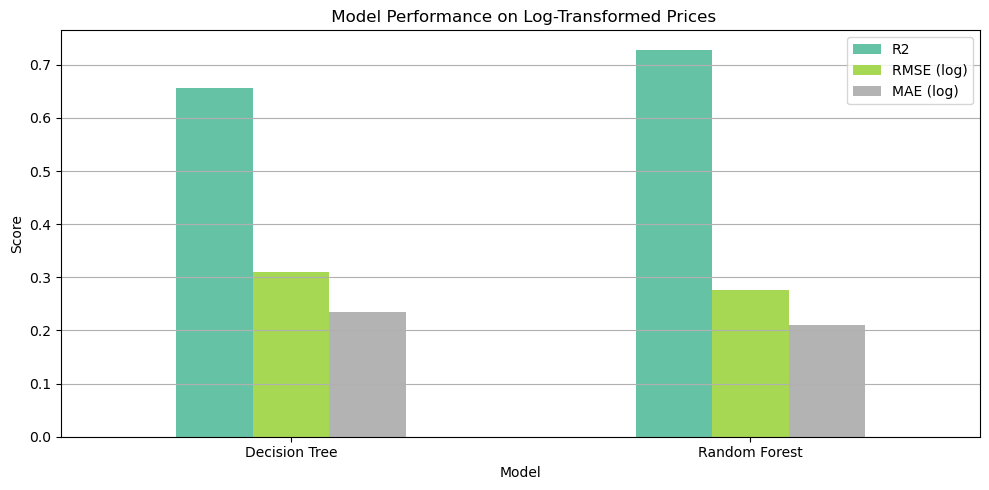
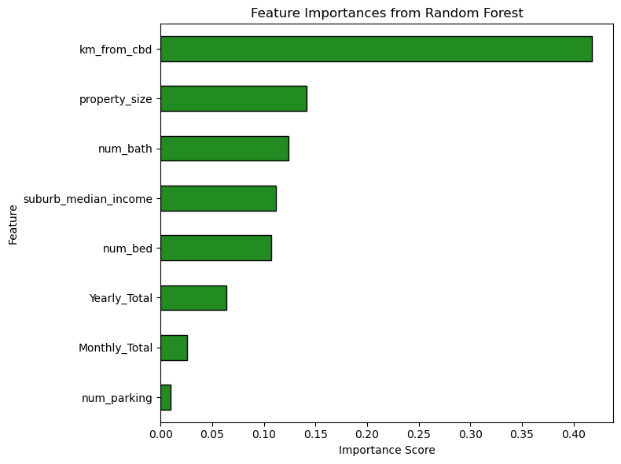
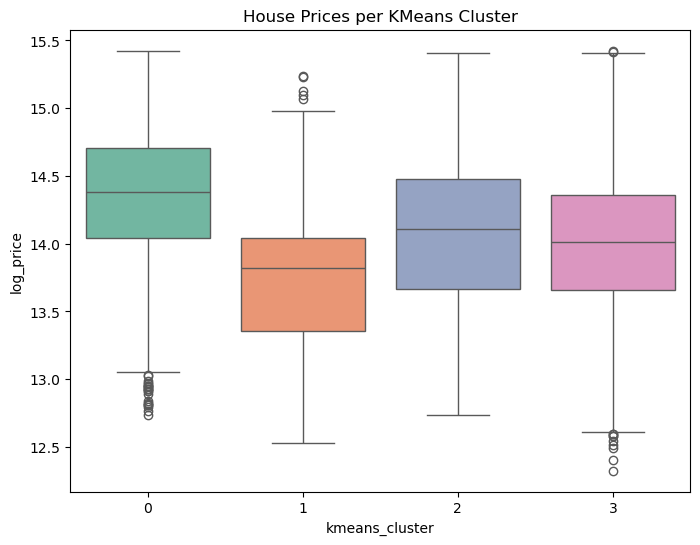
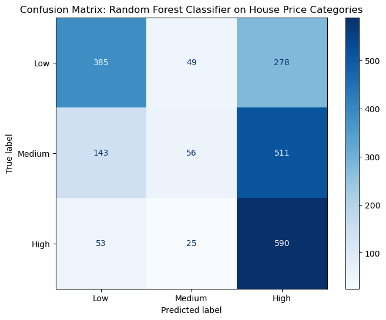

# Analyzing External Factors Influencing House Prices: The Role of Crime and Household Income in Sydney’s Suburbs (2016– 2021)

## Overview

This project examines how suburb-level external factors — specifically crime intensity and household income — influence residential house prices across Sydney between 2016 and 2021.
While traditional property valuation models focus primarily on structural characteristics such as size, age, and property type, this analysis examines whether socio-economic and public safety indicators provide additional explanatory and predictive power.
The project integrates monthly crime data from BOCSAR with residential sales records and suburb-level income indicators to explore both structural relationships and predictive performance.

Both supervised and unsupervised learning approaches are applied:

- Clustering methods (KMeans, DBSCAN) are used to uncover structural groupings of suburbs based on crime intensity, total crime volume, and household income levels.
- Baseline models (Linear Regression, Polynomial Regression, KNN) are implemented to establish a performance benchmark under linear and parametric assumptions.
- Tree-based models (Decision Tree, Random Forest) are applied to model complex, non-linear relationships and interaction effects between socio-economic and property variables.

The comparative evaluation is designed to demonstrate the limitations of linear regression in capturing suburb-level heterogeneity and interaction effects.
The best-performing model (Random Forest) achieved R² = 0.7285, showing strong non-linear effects dominated by location and property structure.

## Research Questions

1. How do different crime categories (e.g., violent vs property crime) quantitatively influence average residential house prices across Sydney suburbs over time?

2. Can suburbs be grouped into meaningful clusters based on crime intensity, total crime volume, and household income — and do these clusters exhibit distinct pricing patterns?

3. To what extent can house prices be predicted using crime intensity, income levels, and property characteristics, and which variables contribute most according to tree-based models?

4. How does categorical crime intensity (Low, Medium, High) affect house price distributions, and can price categories be predicted using only categorical variables such as crime level, property type, and suburb?

## Data Sources

1. Sydney Residential House Prices (2016–2021)  
   **Source**: Kaggle - [Sydney House Prices](https://www.kaggle.com/datasets/alexlau203/sydney-house-prices)
   **Description**: The dataset captures detailed real estate transaction records, including property-specific attributes and contextual suburb-level data.

2. NSW Recorded Crime Data (BOCSAR)  
   **Source**: NWS Gocernment website - [NSW Bureau of Crime Statistics and Research (BOCSAR)](https://bocsar.nsw.gov.au/statistics-dashboards/open-datasets/criminal-offences-data.html)
   **Description**: This dataset contains monthly suburb-level crime statistics across New South Wales, including offence categories and subcategories (e.g., Homicide, Assault, Domestic Violence). It spans January 1995 to December 2024. For this project, the data was cleaned and filtered to retain only the 2016–2021 period to align with the property market dataset.

3. Household Income Data  
   Source: <ABS link>  
   Description: Suburb-level median income indicators.

Raw datasets are excluded due to size constraints.  
After downloading, place them inside the "data" folder.

## Methodology

The analysis follows a structured data science pipeline:

### Data Preparation

- Cleaned and standardised housing, crime, and income datasets
- Filtered to 2016–2021 for temporal alignment
- Applied log transformations to highly skewed variables
- Identified and treated extreme outliers

### Feature Engineering

- Log-transformed house prices and monthly crime totals
- Constructed monthly and yearly crime indicators
- Created crime intensity categories (Low / Medium / High)
- Standardised suburb and time identifiers

### Data Integration

- Merged datasets using suburb–year–month alignment
- Applied inner join for complete observations
- Validated post-merge integrity (missing values, duplicates)

### Exploratory Analysis

- Analysed distributions and correlations
- Identified evidence of non-linear relationships

## Modelling Approach

A progressive modelling strategy was implemented to evaluate increasing levels of model flexibility and capture suburb-level housing dynamics.

1. Baseline Models

Linear Regression was applied as an interpretable benchmark under linear assumptions to assess whether crime intensity and income exhibit a simple linear relationship with house prices.

Polynomial Regression and KNN were introduced to explore moderate non-linear patterns while maintaining relatively simple model structures.

2. Clustering (Unsupervised Learning)

KMeans and DBSCAN were used to identify structural groupings of suburbs based on crime intensity, total crime volume, and household income.
This step aimed to uncover latent socio-economic patterns and examine whether clusters display distinct pricing behaviour.

3. Tree-Based Models (Advanced Stage)

Decision Tree and Random Forest models were implemented at the final stage to capture complex non-linear relationships and interaction effects between crime, income, and structural property variables.

Tree-based methods allow modelling of suburb-level heterogeneity without strict linearity assumptions and provide feature importance insights.

Comparative evaluation across models highlights the limitations of linear regression in representing complex suburb-level dynamics and demonstrates the advantages of tree-based approaches in capturing non-linear dependencies.

## Evaluation & Results

1. Baseline Models (Linear & Parametric)

Baseline linear models demonstrated severe underfitting:

- Linear Regression: R² = 0.0748
- KNN: R² = 0.1053
- Polynomial Regression: unstable and prone to overfitting

As predicted, crime categories alone provide limited explanatory power under linear assumptions.

2. Clustering Results (Unsupervised Learning)

Both KMeans and DBSCAN identified meaningful suburb groupings based on crime and income indicators.

- KMeans: Silhouette = 0.4489
- DBSCAN: Silhouette = 0.8328

DBSCAN additionally detected outlier suburbs with unusual crime–income profiles.

Clusters exhibited distinct house price distributions, suggesting that crime and income contribute to structural socio-economic segmentation, even if they are weak standalone predictors in regression.

3. Tree-Based Models (Advanced Stage)

Tree-based models significantly improved predictive performance.

| Model         | R²     | RMSE (log) |
| ------------- | ------ | ---------- |
| Decision Tree | 0.6556 | 0.3104     |
| Random Forest | 0.7285 | 0.2756     |

Random Forest explained ~73% of variance in house prices, demonstrating strong non-linear interactions between structural and socio-economic variables.

Feature importance analysis revealed:

- Strongest predictors: distance to CBD, property size, number of bathrooms
- Moderate influence: suburb median income
- Lower influence: crime intensity variables

This indicates that crime contributes indirectly but is not a dominant standalone predictor when structural and location features are included.

4. Categorical Crime-Only Models

When using only categorical variables (crime level, property type, suburb):

- Regression R² dropped to 0.187
- Classification accuracy ≈ 49%

This confirms that categorical crime intensity alone is insufficient for accurate price prediction.

## Visual Results

1. Model Performance Comparison

Random Forest substantially outperformed Decision Tree across all evaluation metrics.

2. Feature Importance (Random Forest)

Distance to CBD emerged as the dominant predictor, followed by structural property attributes and median income. Crime-related variables showed relatively low importance.

3. Suburb Clustering (KMeans)

Clustering revealed meaningful socio-economic groupings of suburbs, with clear differences in price distributions across clusters.

4. Price Category Classification (Confusion Matrix)

The classifier performed well on "Low" and "High" price categories but struggled with the "Medium" class due to overlapping feature distributions.

## Key Insights

1. Crime Has Limited Direct Impact

Individual crime categories (e.g., theft, assault, property damage) showed weak and inconsistent relationships with house prices.

Even aggregate crime measures provided only modest explanatory value. Under linear assumptions, crime-related features explained very little variance in property prices.

2. Model Complexity Matters

Baseline linear models severely underfit the data:

- Linear Regression performed poorly
- Feature selection (RFE) and Polynomial Regression did not improve performance
- KNN provided only modest gains (R² ≈ 0.11)

In contrast, increasing model flexibility significantly improved results:

- Decision Tree: R² ≈ 0.66
- Random Forest: R² ≈ 0.73

The substantial performance gap demonstrates that housing price formation is strongly non-linear and driven by interaction effects. Simple linear assumptions are insufficient to capture suburb-level dynamics

3. Location and Structure Dominate

Feature importance analysis revealed:

- Strongest predictor: distance to CBD (km_from_cbd)
- Followed by: property size, number of bathrooms, and suburb median income
- Crime-related variables had consistently low importance

This indicates that location and structural characteristics dominate price formation, while crime plays a secondary role.

4. Urban Segmentation Is Evident

Clustering (KMeans & DBSCAN) revealed meaningful socio-economic groupings of suburbs based on crime intensity and income.

Clusters exhibited distinct average price levels, confirming broader urban stratification across Sydney.

5. Categorical Crime Levels Are Insufficient

When using only categorical crime intensity (Low / Medium / High):

- Regression performance declined substantially
- Classification accuracy remained below 50%

Therefore, crime categories are unsufficient resolution for reliable price prediction.

6. Final Takeaway
   Crime contributes to housing market dynamics but is not a dominant standalone driver.

Sydney house prices are primarily shaped by:

- Location
- Structural property characteristics
- Socio-economic context

The modelling comparison demonstrates that housing price formation is fundamentally non-linear. Linear models severely underfit, while tree-based ensemble methods effectively capture interaction effects and suburb-level heterogeneity.

## Reproducibility

1. Clone the repository
2. Install dependencies: pip install -r requirements.txt
3. Download datasets and place them in `data/`
4. Run the notebook in `notebooks/`

## Limitations and Future Improvements

1. Limited predictive impact of crime features:

Crime-related variables demonstrated limited standalone predictive power relative to location and structural attributes. Including additional contextual factors (e.g., school quality, transport access, amenities) could improve explanatory power.

2. Temporal Modelling Not Included:

Although the dataset spans six years, observations were treated independently. Future work could incorporate lagged variables or time-series models to better capture dynamic crime–price relationships.

3. Poor performance on Medium price classification:

The price-category classifier struggled to separate the Medium class (feature overlap + class imbalance), suggesting that categorical features alone lack resolution for mid-range pricing.

4. Loss of detail due to suburb-level aggregation:

Data was analysed at the suburb level, which may mask variation within large suburbs. More granular spatial data (e.g., SA1-level or geocoded properties) could enhance spatial accuracy.

5. Interpretability limitations of ensemble models:

While Random Forest achieved the strongest performance, ensemble models reduce transparency. Applying interpretability tools (e.g., SHAP) could provide deeper insight into individual predictions.

## Project Structure

├── notebooks/ # Jupyter analysis
├── data/ # Raw data (needs to be downloaded)
├── images/ # Saved visualisations
├── requirements.txt
├── README.md

## Tech Stack

- **Language:** Python
- **Environment:** Jupyter Notebook, Git/GitHub
- **Data Processing:** pandas, NumPy
- **Visualisation:** Matplotlib, Seaborn
- **Machine Learning:** scikit-learn (Linear/Polynomial Regression, KNN, Decision Tree, Random Forest, KMeans, DBSCAN)
- **Evaluation:** R², RMSE, MAE, Silhouette Score, Calinski–Harabasz, Confusion Matrix
